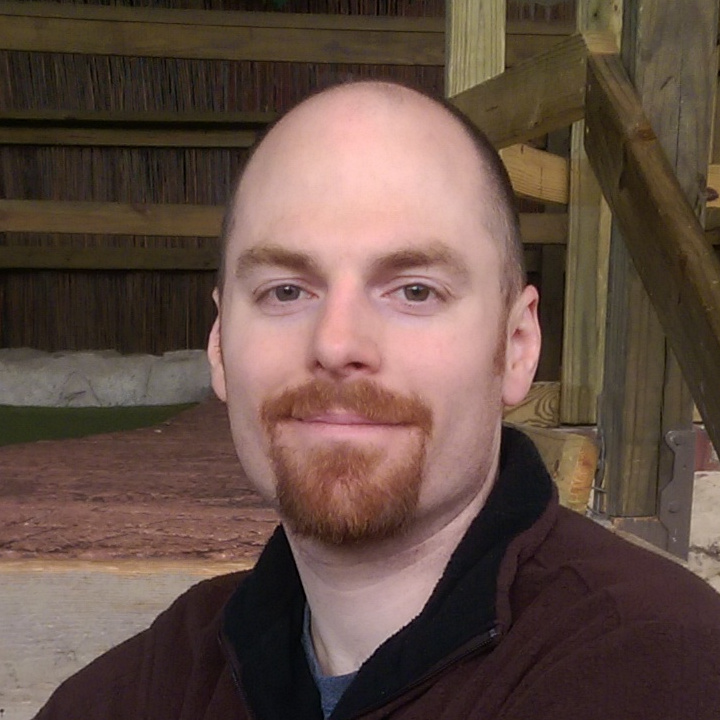

# Randy Syring

I am the Chief Executive Developer at [Level 12](http://www.level12.io), a web & database
development shop that uses solid engineering, proactive communication, and modern development
practices to make our customers really, really, happy.

I have has been programming professionally since 2004 and have been leading development teams since
2007.  I have a B.S. in Computer Science and Mathematics and a M.A. in Biblical Counseling.

I'm passionate about the Python programming language, software craftsmanship, Agile methodologies,
automated testing, and engaging the next generation of developers.

* Founder of and regular speaker at [DerbyPy](http://www.meetup.com/DerbyPy/)
* Creator and contributor to a number of OSS projects that can be found at:
  * https://github.com/rsyring
  * https://github.com/level12
  * https://github.com/derbypy

## Presentations

I've created this quick-reference guide to easily recall the presentations I've given and the
resources associated with them.

*Note:* links to conference session pages will often die as the conference preps for the next year.
Not much I can do about that, sorry!  :)

### Woven Podcast: Learning the Hard Work of Hiring

Jan 29th, 2019: An interview with [Wes Winham](https://software.fireside.fm/randy-syring) of
[Woven](https://www.woventeams.com/) with a bit of my background and some thoughts on hiring.

### DerbyPy March 2018: Snacking on Celery

An Introduction to Task Queueing with Python: at our March monthly meetup we'll be taking a look at Celery, an asynchronous task/job queue based
on distributed message passing. Celery and it's various backends can end up being very complex.
We'll do a gentle introduction with typical use cases. We'll then look at how to do unit and
functional testing with your Celery tasks and PyTest.

* Date: March 22nd, 2018
* [Event Page](https://www.meetup.com/derbypy/events/vrzqnmyxfbdc/)
* [GitHub Repo](https://github.com/DerbyPy/snacking-celery)
* [Video of Presentation](https://www.dropbox.com/s/r9z3hyliacbjpfk/zoom_0.mp4?dl=0)

### PyTennessee 2017: Continuous Integration For The Win!

Learn how to increase the quality of your code and improve team productivity by leveraging a CI
pipeline to run tests, lint, and measure code coverage. Then, integrate all that knowledge right
into a GitHub pull request for easy team review & verification before deployment. Finally, discuss
the cultural challenges that can be met by those that want to integrate CI into their team.

* Date: Feb 4th, 2017
* [Conference Session Page](https://www.pytennessee.org/schedule/presentation/136/)
* [Slides](https://cdn.rawgit.com/rsyring/2017-pytn-ci-ftw/master/_build/slides/index.html)
* [Slides GitHub repo](https://github.com/rsyring/2017-pytn-ci-ftw)

### CodeMash 2017: Automation For The Win!

A great development workflow will make your good developers great, and your great developers
exceptional and automation is a cornerstone of a great development workflow. Every task that can be
done by a machine should be. Continuous Integration (CI) is the practice of testing each change done
to your codebase automatically and as early as possible. Learn how to increase the quality of your
code and improve team productivity by leveraging a CI pipeline to run tests, lint, and measure code
coverage. Then, integrate all that knowledge right into a GitHub pull request for easy team review &
verification before deployment.

* Date: Jan 12th, 2017
* [Conference Session Page](http://www.codemash.org/session/automation-for-the-win/)
* [Slides](https://cdn.rawgit.com/rsyring/codemash-automation-ftw/master/_build/slides/index.html)
* [Slides GitHub repo](https://github.com/rsyring/codemash-automation-ftw)
* [Video](https://www.youtube.com/watch?v=vmdnF8wJqzY>) (audio is low, sorry)

### Custom Software Risks & Rewards: Protecting ROI using Agile methods

During our Lunch & Learn, Randy Syring, Chief Executive Developer at [Level
12](https://www.level12.io/), will explore how an Agile approach is designed specifically to protect
the ROI of a project and to overcome the risks associated with custom software development using a
traditional (waterfall) model.

* Date: Aug 26th, 2016
* [Slides](https://cdn.rawgit.com/rsyring/2016-08-lal-software-risks-rewards/master/_build/slides/index.html)
* [Slides GitHub repo](https://github.com/rsyring/2016-08-lal-software-risks-rewards)

### PyOhio 2016: Continuous Integration For The Win!

Learn how to increase the quality of your code and improve team productivity by leveraging a CI
pipeline to run tests, lint, and measure code coverage. Then, integrate all that knowledge right
into a GitHub pull request for easy team review & verification before deployment.

* Date: June 30th, 2016
* [Slides](https://cdn.rawgit.com/rsyring/continuous-integration-ftw/master/_build/slides/index.html)
* [Slides GitHub repo & abstract](https://github.com/rsyring/continuous-integration-ftw)
* [Video](https://www.youtube.com/watch?v=K-iii4kMLWE) (video starts a few minutes into the talk)

### Code PaLOUsa 2016: Testing Application Boundaries

When it comes to automated tests, testing our internal code is often the easiest. But when it comes
to things like Databases, Email, Web APIs, that is, when we cross our application's outer
"boundary", testing can get really difficult really fast. In this talk, we will look at best
practices for automated testing around areas of our application that reach beyond it's "boundary."

* Date: April 2016
* [Slides](<https://cdn.rawgit.com/rsyring/cp-2016-testing-boundaries-slides/master/_build/slides/index.html)
* [Slides GitHub repo & abstract](https://github.com/rsyring/cp-2016-testing-boundaries-slides)

### Code PaLOUsa 2016: Automated Testing Overview & Best Practices

We'll cover testing best practices, ways to make team testing more effective, test centric vs test
driven development, and how to get started testing when there are no tests and the code is messy.
We'll use an example project to see how these ideas flush out in the real world.

* Date: April 2016
* [Slides](https://cdn.rawgit.com/rsyring/cp-2016-testing-intro-slides/master/_build/slides/index.html)
* [Slides GitHub repo & abstract](https://github.com/rsyring/cp-2016-testing-intro-slides)

### PyOhio 2015: Testing the Database Layer: typical problems & best practices

Learn how to increase the quality of your code and improve team productivity by leveraging a CI
pipeline to run tests, lint, and measure code coverage. Then, integrate all that knowledge right
into a GitHub pull request for easy team review & verification before deployment.

* Date: Aug 2nd, 2015
* [Slides](https://cdn.rawgit.com/rsyring/db-testing-slides/master/_build/slides/index.html)
* [Slides GitHub repo](https://github.com/rsyring/db-testing-slides)
* [Video](https://www.youtube.com/watch?v=ZBLaHL1mTW0)

### Pythology 101: Testing Methodology & Best Practices

We'll cover testing best practices, ways to make team testing more effective, test centric vs test
driven development, and how to get started testing when there are no tests and the code is messy.
We'll use an example project to see how these ideas flush out in the real world.

* Date: Jan 2015
* [Video](https://www.youtube.com/watch?v=tj4OoecYF3E)

### PyTexas 2014: Reliable Testing & Deployments with pip and wheels

I plan to briefly introduce pip requirements files and the wheel format. I will then demonstrate an
approach for structuring requirements files, using "snapshot" requirement files, and building
"wheelhouses" that get committed to your VCS.

* Date: Oct 5th, 2014
* [Video](https://www.youtube.com/watch?v=FcRgR7bBIUU)

### PyTexas 2014: Dates & Time: pain points, useful libraries, and testing considerations

Date & Time handling in Python has it's ups & downs. In this talk, we will cover:

* some of the pain points and weaknesses in the Python standard library
* two libraries I have found helpful: dateutils and arrow
* best practices for working with timezones
* best practices for testing code that deals with dates and time

Details:

* Date: Oct 4th, 2014
* [Video](https://www.youtube.com/watch?v=GZl-13bbq60)
